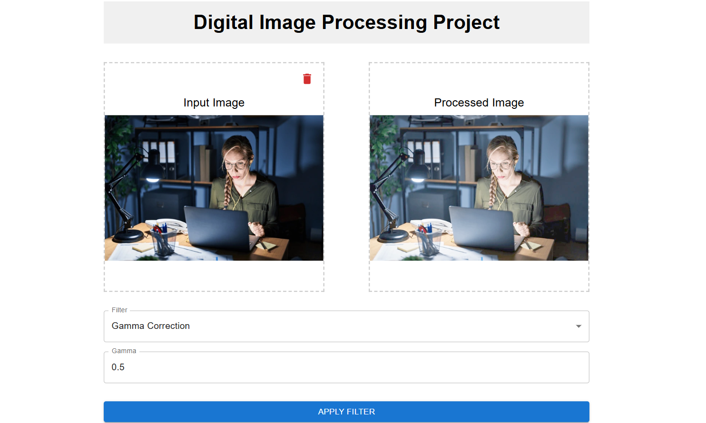

# 🖼️ **Digital Image Processing Application**

This project provides a complete **Image Processing Application** with a user-friendly frontend built using **React.js** and **Material-UI**, and a robust backend using **Flask** and **OpenCV**.

---

### 🖼️ Sample UI
Below is an example of the application's interface:



## 🚀 **Prerequisites**

Make sure the following tools are installed on your system:

- ✅ **Node.js** (v16 or later)
- ✅ **npm** (comes with Node.js)
- ✅ **Python** (v3.8 or later)
- ✅ **pip** (Python package manager)

---

## 🛠️ **Backend Setup**

1. **Clone the repository:**
   ```bash
   git clone <repo-link>
   cd <repo-folder>/backend
   ```

2. **Create a virtual environment:**
   ```bash
   python -m venv venv
   ```

3. **Activate the virtual environment:**
   - On **Windows**:
     ```bash
     venv\Scripts\activate
     ```
   - On **macOS/Linux**:
     ```bash
     source venv/bin/activate
     ```

4. **Install required dependencies:**
   ```bash
   pip install -r requirements.txt
   ```

5. **Run the Flask backend server:**
   ```bash
   python app.py
   ```
   The backend server will start at: **`http://127.0.0.1:5000/`**.

---

## 💻 **Frontend Setup**

1. **Navigate to the frontend directory:**
   ```bash
   cd <repo-folder>/frontend
   ```

2. **Create a React app and install dependencies:**
   ```bash
   npx create-react-app image-processing-app
   cd image-processing-app
   npm install @mui/material @emotion/react @emotion/styled @mui/icons-material react-dropzone axios
   ```

3. **Start the React development server:**
   ```bash
   npm start
   ```
   The frontend server will run at: **`http://localhost:3000/`**.

---

## 🖥️ **How to Use the Application**

1. Start the **Flask Backend** server.
2. Start the **React Frontend** application.
3. Upload an image on the frontend interface.
4. Select a filter (e.g., gamma correction, Sobel edge detection) to process the image.
5. View the processed image returned from the backend.

---

## 📦 **Dependencies**

### **Frontend:**
- **React.js**
- **Material-UI**
- **React-Dropzone**
- **Axios**

### **Backend:**
- **Flask**
- **Flask-CORS**
- **NumPy**
- **OpenCV**
- **SciPy**
- **Pillow**

---

## 📂 **Project Structure**

```bash
project-root/
|
|-- backend/                   # Flask backend code
|   |-- app.py                 # Main backend server file
|   |-- requirements.txt       # Backend dependencies
|
|-- frontend/                  # React.js frontend code
|   |-- src/
|   |   |-- App.js             # Main React app component
|   |-- package.json           # Frontend dependencies
|
|-- README.md                  # Project instructions
```

---

## ⚠️ **Important Notes**

- Ensure both the **backend** and **frontend** servers are running simultaneously.
- If **CORS issues** occur, make sure **Flask-CORS** is installed and configured on the backend.
- Update the **backend API URL** in the frontend code if necessary.

---

## 👨‍💻 **Author**

[Hanzla Tahir]  
📧 *hanzalatahir45@gmail.com*  


---

**Happy Coding!** 🚀🎉

